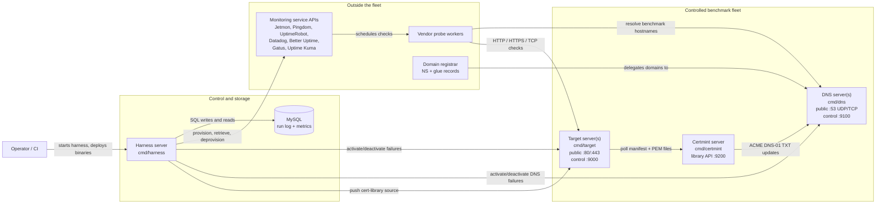

# uptime-bench Fleet Overview

This document explains the runtime fleet: the servers uptime-bench operates,
what each component is for, and how traffic moves between them. It is focused
on the deployed test environment rather than every Go package in the repo.

## Fleet At A Glance

## Server Roles

| Component | Runs | Public traffic | Control traffic | Purpose |
|---|---|---|---|---|
| Harness server | `cmd/harness`, usually MySQL | None required for probes | Outbound to every fleet member and monitoring API | Orchestrates runs. It reads `fleet.toml`, `services.toml`, and scenario/campaign TOML, provisions monitors, activates failures, collects reports, records ground truth, derives metrics, and generates campaign data. |
| MySQL | MySQL server | None | SQL from harness, measurement, and report tooling | Stores the canonical record: scenario runs, campaign runs, ground-truth events, monitor reports, and derived metrics. It is the audit trail, not a cache. |
| Target server | `cmd/target` | HTTP on `:80`, HTTPS on `:443`, TCP probe traffic | Authenticated HTTP control on `:9000` | Hosts the benchmark websites. It injects non-DNS failures such as HTTP status changes, timeouts, partial bodies, redirects, content tampering, TCP failures, and TLS failures. |
| DNS server | `cmd/dns` | Authoritative DNS on `:53` UDP/TCP | Authenticated HTTP control on `:9100` | Serves benchmark domains and injects DNS failures. Multiple DNS servers let the benchmark fail one nameserver while others remain healthy. |
| Certmint server | `cmd/certmint` | Optional read-only cert-library API on `:9200` | ACME TXT writes to DNS server control APIs | Produces the certificate library used by TLS expiry and expiring-certificate scenarios. It mints certificates slowly, archives them, and publishes a manifest plus PEM files for targets to poll. |
| Monitoring services | Vendor-hosted services and Jetmon deployments | Probe traffic originates from vendor infrastructure | API calls from adapters | These are the systems being evaluated. uptime-bench configures their monitors, then records what they detected and when. |

## Traffic Planes

### Public probe plane

This is the path monitoring services see. It should look like ordinary internet
monitoring against ordinary websites.

1. A vendor probe resolves a benchmark hostname through the fleet DNS servers.
2. The DNS server returns normal records or an injected DNS failure.
3. The probe connects to the target server on HTTP, HTTPS, or TCP.
4. The target returns a healthy response or an injected target-side failure.
5. The monitoring service records any incident state in its own system.

This plane intentionally does not expose the harness. If a monitor can
fingerprint the harness or control plane, the benchmark is no longer measuring
normal monitoring behavior.

### Control plane

This is private operational traffic initiated by uptime-bench.

| Source | Destination | Purpose |
|---|---|---|
| Harness | Target control `:9000` | Activate/deactivate target failures and push cert-library configuration. |
| Harness | DNS control `:9100` | Activate/deactivate DNS failures. |
| Harness | Monitoring service APIs | Provision monitors, retrieve incident data, deprovision monitors, and configure maintenance windows where supported. |
| Certmint | DNS control `:9100` | Install and remove ACME DNS-01 TXT records during certificate issuance. |
| Target | Certmint library API `:9200` | Poll `manifest.json` and referenced PEM files, then update the in-memory certificate library. |

All fleet control endpoints use bearer-token authentication and live on ports
separate from the public data-plane services.

## Component Details

### Harness server

The harness is the conductor. It does not serve the test websites and it should
not be in the path of vendor probes.

It is responsible for:

- loading fleet and service configuration;
- constructing the enabled adapters;
- resolving scenario targets to fleet members;
- asking adapters to provision monitors;
- activating and deactivating failures on target or DNS servers;
- writing ground-truth events to MySQL;
- retrieving monitor reports from vendor APIs;
- deprovisioning monitors and cleaning up adapter state;
- deriving metrics at the end of a run or campaign.

The harness also pushes the certmint library URL to target servers when `[certmint]`
is configured in `fleet.toml`.

### Target servers

Target servers are the websites under test. A single target can host many benchmark
sites by virtual hostname. HTTP routing uses the `Host` header; HTTPS routing
uses SNI.

For capacity tests, a target can also declare generated site ranges in
`fleet.toml` with `[[targets.generated_sites]]`. DNS resolves matching
hostnames from the configured pattern and range without expanding every host
into the static zone map, while the target serves those Host headers normally.

Target-side failure layers:

| Layer | Examples | Why it lives on the target |
|---|---|---|
| TCP | refused connections, stalled connections | These happen before HTTP exists. |
| TLS | expired cert, expiring cert, invalid cert, deprecated TLS, handshake abort | These happen during HTTPS negotiation before application content is visible. |
| HTTP | status codes, timeouts, partial bodies, redirects | These are application-layer website failures. |
| Content | missing canary, injected keyword, error page, defacement, malicious script, spam links | These keep `200 OK` while changing the body, which tests content-aware monitors. |

Targets store active failure state in memory and expire failures by duration.
The harness still sends explicit deactivate calls at the end of a scenario so
the next run starts cleanly.

### DNS servers

DNS servers are authoritative nameservers for the benchmark domains. They are not a
mock resolver used only by tests; vendor probes interact with them through real
DNS delegation.

They are responsible for:

- serving A records for benchmark websites;
- serving NS and SOA records for delegated zones;
- returning DNS failure modes such as NXDOMAIN, SERVFAIL, latency, or partial
  nameserver unavailability;
- serving ACME TXT records that certmint installs through the control API.

At least two DNS servers are recommended. One-DNS fleets can run HTTP, TCP, and TLS
scenarios, but nameserver-availability scenarios need multiple authoritative
servers.

### Certmint server

Certmint exists because TLS expiration tests need certificates at known ages.
The target should not mint certificates during a benchmark run.

Certmint is responsible for:

- issuing Let's Encrypt certificates on a steady cadence;
- using DNS-01 challenges through the fleet DNS servers;
- archiving immutable certificate snapshots;
- publishing `manifest.json` and PEM files through a read-only library API;
- trimming stale entries according to retention rules.

Targets poll certmint and cache the library locally. During a TLS scenario, the
target chooses the certificate whose manifest metadata best matches the active
failure parameters.

### Monitoring Services

Monitoring services are outside the fleet, but they are part of the benchmark
loop. Adapters configure them through service APIs, while their probe workers
hit the fleet through public DNS and target endpoints.

uptime-bench treats each service through the same adapter contract:

- declare capabilities;
- provision a monitor;
- retrieve incident state for the run window;
- normalize raw service classifications;
- deprovision and clean up.

Capability mismatches are recorded as data, not hidden. For example, if a
service cannot perform a required keyword or maintenance-window behavior, the
harness skips provisioning and records `reason_code = "capability_mismatch"`.

## What Each Config File Describes

| File | Describes |
|---|---|
| `fleet.toml` | Fleet members, domains, target hostnames, control addresses, certmint URL, and adapter call budgets. |
| `services.toml` | Which monitoring services are enabled and the credentials/options needed by their adapters. |
| `scenarios/*.toml` | One targeted run: target, monitors, failure types, timing, keyword checks, and maintenance window if any. |
| Campaign TOML | A generated-run plan: seed, sample design, failure cells, replay counts, duration buckets, and scheduling rules. |

## Minimum And Recommended Fleet

Minimum useful fleet:

- 1 harness server with MySQL;
- 1 target server;
- 1 DNS server for HTTP/TCP/TLS scenarios, or 2 DNS servers for nameserver-failure scenarios.

Recommended fleet:

- 1 harness server;
- 2 or more target servers;
- 2 DNS servers;
- 1 certmint server;
- multiple delegated test domains.

More target servers and domains make it easier to run concurrent campaigns without
different scenarios interfering with each other's host/path or DNS state.
