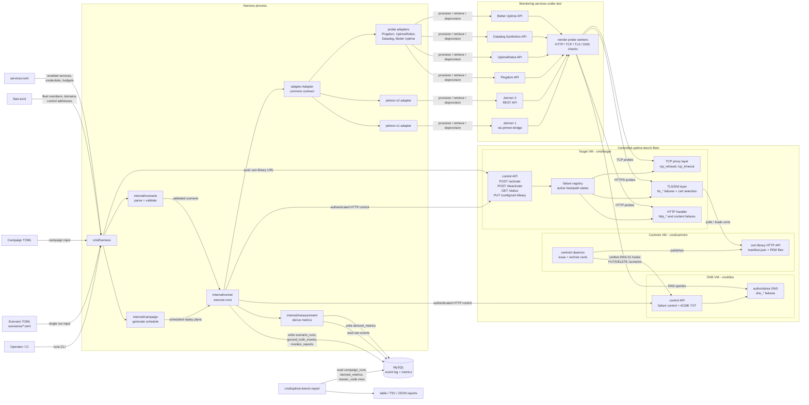
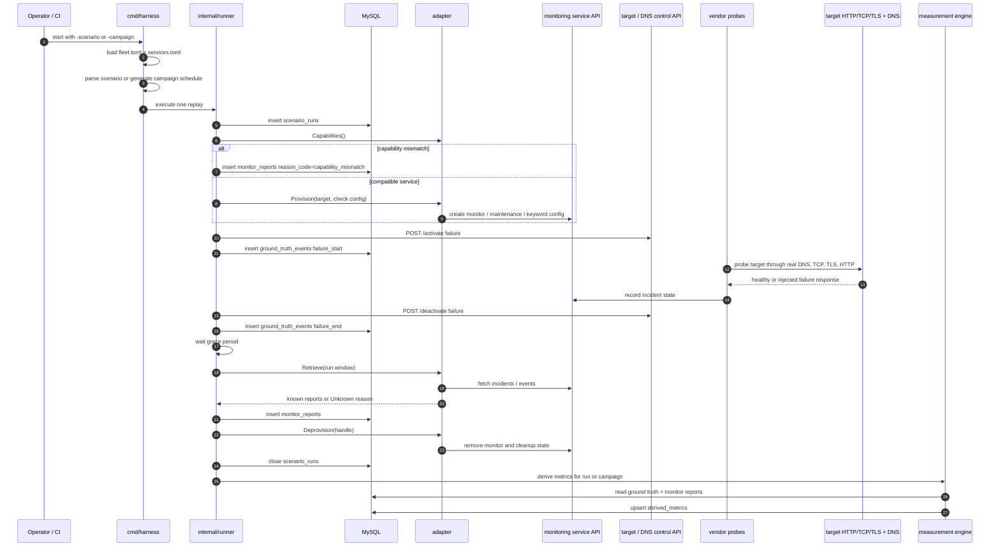
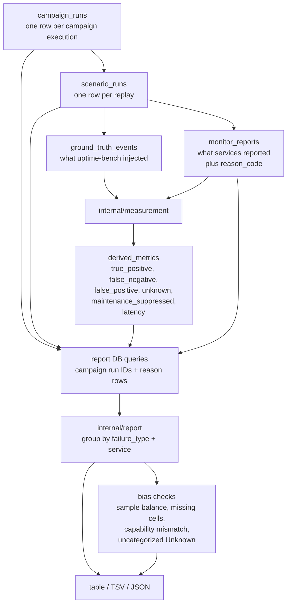

# uptime-bench System Map

This map shows the moving parts in uptime-bench, what each part is for, and
how the pieces communicate during single-scenario and campaign runs.

## Component Map

## Scenario Run Sequence

## Data And Reporting Flow

## Component Responsibilities

| Part | Purpose | Main communication |
|---|---|---|
| `cmd/harness` | CLI entry point. Loads config, constructs adapters, pushes cert-library config, and starts single-scenario or campaign execution. | Reads TOML files; calls runner; talks to target control APIs for cert-library setup. |
| `internal/scenario` | Parses and validates scenario TOML. Defines target, failures, timing, maintenance, keywords, and monitors. | In-process Go calls from the harness and runner. |
| `internal/campaign` | Generates deterministic randomized campaign designs and schedules from a campaign config and seed. | In-process Go calls; campaign audit rows go to MySQL through the runner. |
| `internal/runner` | Orchestrates each replay: provision monitors, activate failures, record ground truth, retrieve reports, deprovision, and close runs. | MySQL writes; adapter interface calls; authenticated HTTP control calls to fleet members. |
| `adapter.Adapter` implementations | Hide service-specific API behavior behind one contract: capabilities, provision, retrieve, normalize, deprovision. | HTTPS calls to vendor APIs or Jetmon bridge/API. |
| Monitoring services | The systems under evaluation. They run checks and expose incident data through their APIs. | Vendor probes hit target fleet data-plane endpoints; adapters use service APIs. |
| Target VM (`cmd/target`) | Hosts benchmark websites and injects TCP, TLS, HTTP, redirect, timeout, status, and content failures. | Data plane: HTTP/HTTPS/TCP from vendor probes. Control plane: authenticated HTTP from harness. |
| DNS VM (`cmd/dns`) | Authoritative DNS for benchmark domains and DNS failure injection. Also accepts ACME TXT updates for certmint. | DNS from vendor resolvers/probes; authenticated HTTP control from harness and certmint hooks. |
| Certmint (`cmd/certmint`) | Maintains a library of real certificates at different ages for TLS expiry/expiring tests. | Drives DNS-01 via DNS VM control endpoints; serves manifest and PEM files over a read-only HTTP API. |
| MySQL | Canonical event log and metric store. Raw rows are retained so metrics can be recomputed. | SQL from harness, measurement, and report tool. |
| `internal/measurement` | Converts raw ground-truth and monitor-report rows into comparable derived metrics. | SQL reads from raw tables; SQL upserts to `derived_metrics`. |
| `cmd/uptime-bench-report` | Builds human and machine-readable campaign summaries. | SQL reads from campaign, metric, and reason-code rows; writes table, TSV, or JSON to stdout. |

## Communication Boundaries

| Boundary | Protocol | Why it exists |
|---|---|---|
| Harness to fleet control plane | Authenticated HTTP/JSON on dedicated control ports | Keeps failure activation separate from public data-plane traffic. |
| Vendor probes to target fleet | Real DNS, TCP, TLS, and HTTP(S) | Ensures monitors experience the target like a real external website. |
| Adapters to monitoring services | Service-specific HTTPS APIs or Jetmon bridge/API | Encapsulates vendor API differences inside adapters. |
| Certmint to DNS VMs | Authenticated HTTP for ACME TXT records | Lets certbot complete DNS-01 challenges using the same authoritative DNS fleet. |
| Target TLS layer to cert library | HTTP poll plus local cache | Lets targets serve certificate-age scenarios without minting certs during a benchmark run. |
| Core processes to MySQL | SQL | Preserves raw events and derived metrics for audit, recomputation, and reporting. |
